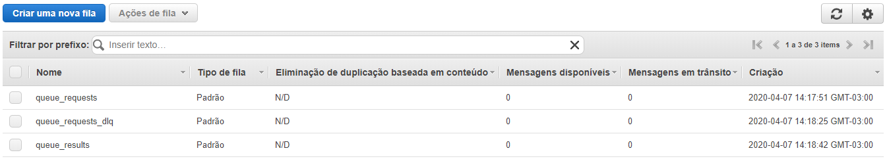
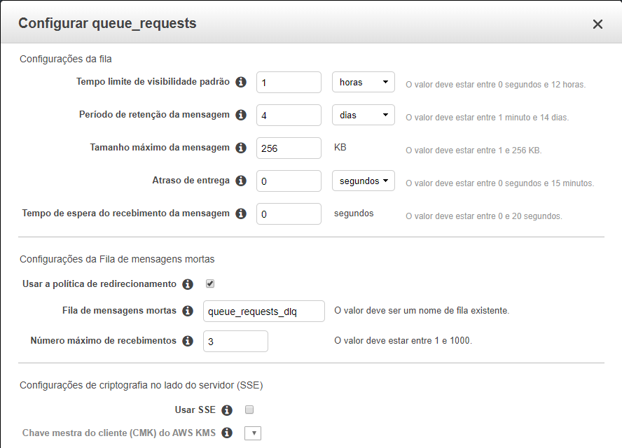

# Using AWS SQS with Spring Boot

## Configuration

In pom.xml

```xml
<dependency>
  <groupId>com.amazonaws</groupId>
  <artifactId>aws-java-sdk</artifactId>
  <version>1.11.759</version>
</dependency>

<dependency>
  <groupId>com.amazonaws</groupId>
  <artifactId>amazon-sqs-java-messaging-lib</artifactId>
  <version>1.0.8</version>
  <type>jar</type>
</dependency>

<dependency>
  <groupId>org.projectlombok</groupId>
  <artifactId>lombok</artifactId>
  <version>1.18.12</version>
  <scope>provided</scope>
</dependency>
```

Configurating Spring Boot with Spring JMS

```java
@Configuration
@EnableJms
public class JmsConfig {

    SQSConnectionFactory connectionFactory = new SQSConnectionFactory(
            new ProviderConfiguration(),
            AmazonSQSClientBuilder.standard()
                    .withRegion(Regions.SA_EAST_1)
                    .withCredentials(new EnvironmentVariableCredentialsProvider())
    );


    @Bean
    public DefaultJmsListenerContainerFactory jmsListenerContainerFactory() {
        DefaultJmsListenerContainerFactory factory =
                new DefaultJmsListenerContainerFactory();
        factory.setConnectionFactory(this.connectionFactory);
        factory.setDestinationResolver(new DynamicDestinationResolver());
        factory.setConcurrency("2-5");
        factory.setSessionAcknowledgeMode(Session.CLIENT_ACKNOWLEDGE);
        return factory;
    }

    @Bean
    public JmsTemplate defaultJmsTemplate() {
        return new JmsTemplate(this.connectionFactory);
    }

}
```
# Receiving messages

A service class should be create to listen to messages from our request queue.

```java
@Service
public class QueueReadingService {

    @JmsListener(destination = "queue_requests")
    public void receiveRequest(String requestJSON) throws InterruptedException {
        (...)
    }
}
```
# Sending messages
```java
@Autowired
protected JmsTemplate defaultJmsTemplate;

public void sendResult(String result) {
  defaultJmsTemplate.convertAndSend("queue_results", result);
}
```

# Test
Three queues must be configureted at AWS: queue_requests, queue_requests_dlq and queue_results:




 
When a message with value equals to "error" is sent, an error is simulated, so application will try to process it three times, and after these fail attempts, it is sent to the final queue dead-letter queue (queue_requests_dlq). With messages diferent from "error", the message will be processed and will sent to queue_results.
